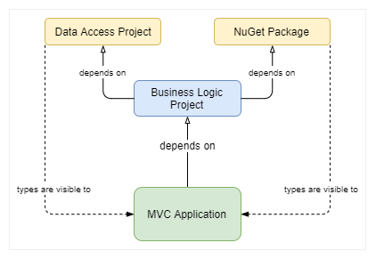

# .NET Core Transitive Dependencies

## The problem



- `Business Logic Project` depends on `Data Access Project` and `NuGet Package`
- `MVC Application` depends on `Business Logic Project`
- By default, in .NET Core, **all types in `Data Access Project` and `NuGet Package` will be visible to `MVC Application`** due to the transitive dependency

The way to change the default behavior is to add `<PrivateAssets>all</PrivateAssets>` for each package/project dependency inclusion

```xml
  <PackageReference Include="Newtonsoft.Json" Version="9.0.1">
    <PrivateAssets>All</PrivateAssets>
  </PackageReference>
```

However, your can add a `Directory.Build.props` file at the root level of your project oor solution

```xml
  <Project>
    <ItemDefinitionGroup>
      <PackageReference>
        <PrivateAssets>all</PrivateAssets>
      </PackageReference>
      <ProjectReference>
        <PrivateAssets>all</PrivateAssets>
      </ProjectReference>
    </ItemDefinitionGroup>
  </Project>
```

## References

- [.NET Core Transitive Dependencies and how to block them](https://curia.me/net-core-transitive-references-and-how-to-block-them/)
- [Customize your build](https://docs.microsoft.com/en-us/visualstudio/msbuild/customize-your-build?view=vs-2019#directorybuildprops-and-directorybuildtargets)
